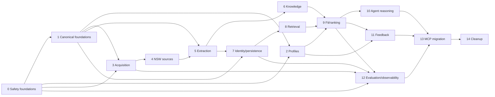

# Jobs implementation graph

Wave 0, Wave 1, Wave 3, and bounded non-persistent Wave 2A are authorized. W2A and W3 may run concurrently. Wave 2B, production persistence, and unresolved retention/encryption gates remain blocked. Graph records dependencies only; it does not claim implementation.

| Wave | Work packages                                                                                                                 | Gate                                                                             |
| ---- | ----------------------------------------------------------------------------------------------------------------------------- | -------------------------------------------------------------------------------- |
| 0    | PII-safe telemetry; safe fetch; parser/network budgets; SourcePolicy skeleton                                                 | Authorized; precedes source expansion                                            |
| 1    | IDs/evidence/claims; listing/observation; posting/intent; reversible identity; pack contracts; legacy mapper                  | Authorized; no unresolved blocker                                                |
| 2    | Secure reader/parser; minimized profile store; profile actions; refresh                                                       | W2A bounded/non-persistent authorized; W2B blocked by encryption + retention ADR |
| 3    | Adapter contract/registry; edge-scoped policy coordinator; additive indexed discovery; JobSpy; slices; budgets; manual import | Authorized; provider authorization does not grant direct publisher access        |
| 4–6  | NSW/source inventory; extraction; enrichment                                                                                  | Per-source/persistence gates unresolved                                          |
| 7–14 | Identity, persistence, retrieval, assessment, reasoning, feedback, MCP migration, cleanup                                     | Existing checkpoints and retention gates                                         |

## Exact dependency matrix

| Package                           | Requires                     | Enables                      |
| --------------------------------- | ---------------------------- | ---------------------------- |
| W3-A acquisition contracts        | W0, W1                       | W3-B, W3-C, W3-D, W3-E, W3-F |
| W3-B edge policy coordinator      | W3-A, SourcePolicy skeleton  | W3-G, direct-call gating     |
| W3-C adapter registry             | W3-A                         | W3-G                         |
| W3-D indexed providers            | W3-A, W3-B, W3-C             | W3-G                         |
| W3-E JobSpy adapter               | W3-A, W3-B, W3-C             | W3-G                         |
| W3-F manual import                | W3-A, W3-B                   | W3-G                         |
| W3-G additive coordinator/budgets | W3-B, W3-C, W3-D, W3-E, W3-F | W3-H, W3-I, W3-J             |
| W3-H destination enrichment       | W3-G, safeFetch              | later extraction/enrichment  |
| W3-I semantic_jobs shadow         | W3-G                         | migration evidence only      |
| W2A-P1 contracts                  | W0, W1                       | W2A-P2, W2A-P3, W2A-P4       |
| W2A-P2 reader                     | W2A-P1                       | W2A-P4                       |
| W2A-P3 minimizer                  | W2A-P1                       | W2A-P4                       |
| W2A-P4 request-scoped service     | W2A-P1, W2A-P2, W2A-P3       | bounded profile use          |

## Closure matrix (required evidence; not implementation claims)

| Priority | Closure requirement                                                                                                                   |
| -------- | ------------------------------------------------------------------------------------------------------------------------------------- |
| P0       | Blocked direct publisher search/fetch makes zero direct calls.                                                                        |
| P0       | Provider authorization cannot grant direct publisher access; provider credentials never reach destination requests.                   |
| P1       | Permitted third-party indexed candidates survive blocked publisher access, remain `indexed_only`, and show caveats.                   |
| P1       | Candidate exposes provider authorization and publisher direct-access states separately; informational coverage never authorizes work. |
| P1       | Discoverer, publisher, and content donor remain distinct; snippets/summaries cannot create publisher-observed claims or observations. |
| P1       | Upgrade requires separately permitted destination evidence or manual evidence; manual evidence remains user-supplied/unverified.      |
| P1       | Composite search calls only explicitly authorized concrete providers; exact direct-source block overrides direct-family policy.       |
| P1       | SEEK indexed candidates may survive; direct SEEK adapter/fetch remains zero-call.                                                     |
| P1       | Wave 2A performs zero profile persistence and grants no reusable handle.                                                              |
| P1       | Wave 2B, persistence, and `query_log` gates remain closed.                                                                            |

Policy is edge-scoped. Evidence has provenance, not policy taint. Legal/confidentiality/safety propagation requires separate explicit classification with cited basis and is outside these packages.

See [architecture](architecture.md), [source coverage](source-coverage.md), and [indexed-discovery amendment](indexed-discovery-amendment.md).

Implementation and offline closure evidence: [Wave 3 acquisition closure evidence](wave-3-acquisition-closure-evidence.md).
